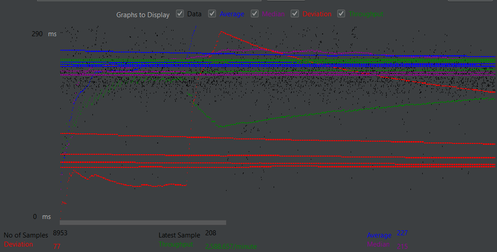
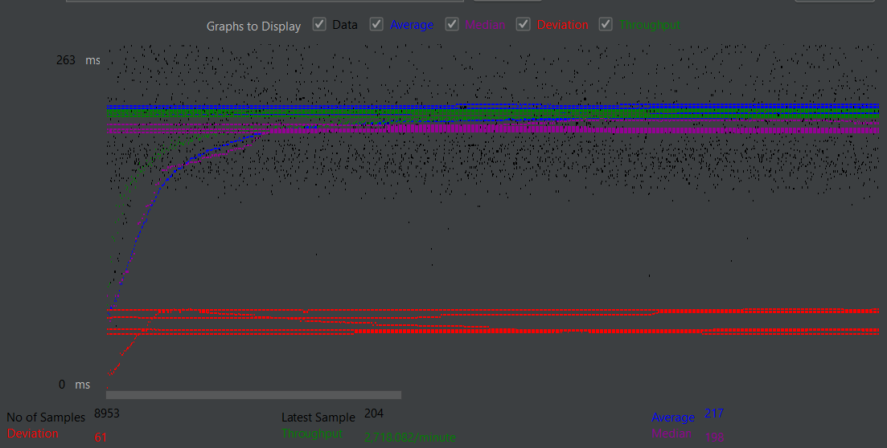
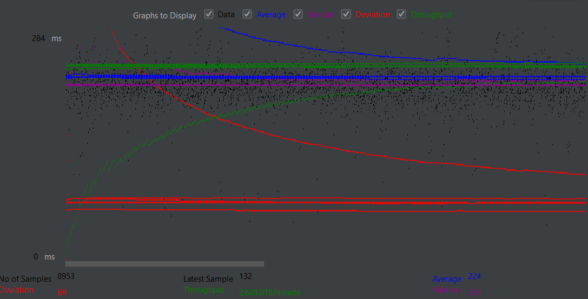
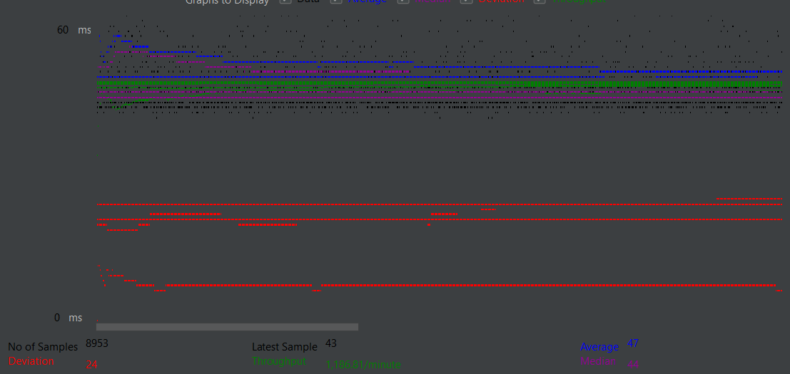
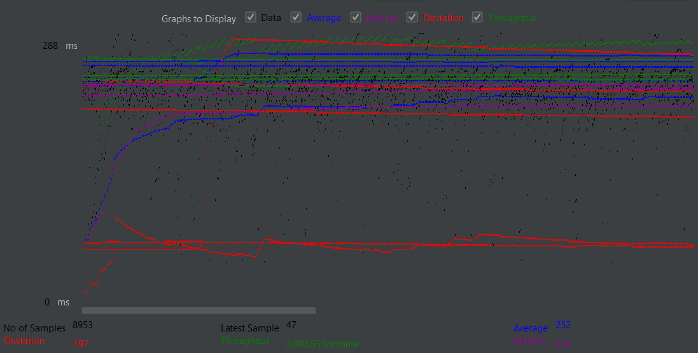
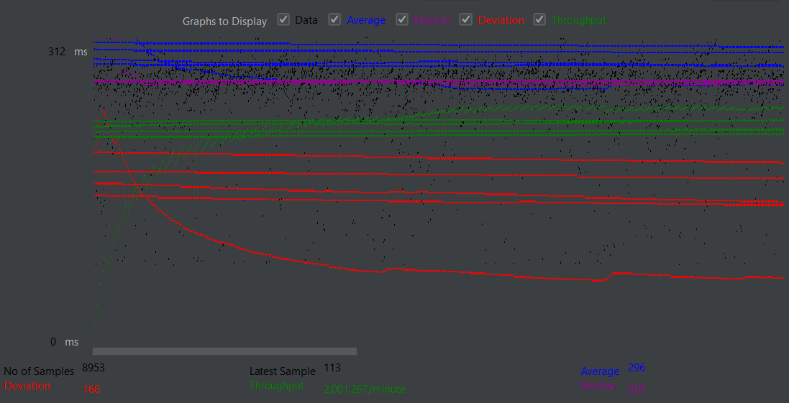

## College recommendation website
### Domain

As opposed to the default Fablix domain, we decided to implement a college recommendation website, where users can view colleges based on rating, SAT scores, or number of votes.

### Database
We used MySQL as our backend database. Our database consists of 9 tables:
- School
- Location
- Genre (types of school)
- Schools_in_locations
- Genre_in_school
- Users
- Recommendation
- Preference
- Ratings

The data we used to populate the database consists of data crawled from the web and artificially generated data. For instance, you will notice some random name college, such as "Consciousness University" or "Hovel College" with randomly genereated SAT scores and LivingCost, all paired with a lively haha yes hedgehog picture.

### Web server
We are using Tomcat10 to host our server and an EC2 t2_micro AWS Ubuntu instance to deploy the application.

### Demo Link
Link to the [demo](https://youtu.be/RS0CCIPbIco)

### Contribution
[Yanran Wang](https://github.com/yanranw1) was responsible for writing the frontend display and the java servelets, also crawling the web for college data.
[Jason Zheng](https://github.com/zjason25) generated artificial data and finalized schemas for the MySQL database, deployed the application on the instance and completed the demo and this README.

Our TA [Xinyuan](https://github.com/aglinxinyuan) and [Yicong](https://github.com/Yicong-Huang) for providing the *cs122b-project1-api-example* from which we can learn build our api for this project.

## [Project 2 Addition]:
### Login
In project 2, we added a sign-in page, a feature that prevents users from accessing any other pages unless signed in.

### Search/Browse
We implemented substring matching in our keyword search by using the LIKE operator in MySQL. Additionally, the website also now supports browsing colleges by their initial letters and type. For instance, a drop-down feature allows the user to select "Public University" and initiate search from there.

### Wishlist(Shopping Cart) and Recommendation(Checkout)
Similar to a shopping cart in the Fablix domain, our college recommendation website CollegeConnector(a placeholder name) uses a wishlist to allows the users to choose a college of their own liking. Inside the wishlist, the user has access to the colleges' info such as name, location, and state. The user can add and delete college inside the wishlist. From the wishlist, the user may proceed to a Calculate Match page, where the user enters personal statistics such as SAT scores, range of tuition cost, and school genre, from which the reader can click on "calculate match", which ultimately directs the reader to a page showing a best-matching college from the user's wishlist.

### How's our domain different from Fablix
We did not include a "sale date" attribute in our schema for the recommendation table, which is equivalent to the sales table in Fablix. Hence, the demonstration only shows a increase in the number of records as proof for successful insert into our recommendation table.

### Link to our [demo](https://youtu.be/7Z1LOKpo5rY) for Project 2

To test our site, use login:
SuzanneAshley16@yahoo.gov and password:
*FOT@!aZy60z
at [link](http://54.67.47.84:8080/cs122b-project2-login-cart-example/login.html)

### Contribution
Huge shout-out to [Yanran](https://github.com/yanranw1) for her tireless efforts in implementing the login and search/browse, and checkout services. [Jason](https://github.com/zjason25) was responsible for writing services related to Wishlist and styling the login and checkout page.

Once again, our TA Xinyuan and Yicong for provided the example codes on session/form and login page from which we can learn build our api for this project.

## Project 3 Addition:

Report inconsistency data: Report inconsistency data to the user and included in README: We inserted all the information from XML. For the celebrity info for each school. We created a new table celebrities to store the celebrity information and use a new table query_celebrities_in_schools to store the relationship between two celebrities and schools. We ignored all repeated information.

## Two optimization strategies:
Our runtime mostly came down to DOM tree construction and SQL insertion. For the former, we opted to disabling XML validation and ExpandEntityReference as to reduce the overhead and additional processing with DOM tree construction. As for our SQL insertion, simply turning off auto-commit was not enough of an improvement. As such, we decided to use one single insert statement to insert multiple values. This measure alone improved our insertion time from minutes to a matter of just a few seconds.

### Prepared Statements:
We used prepared statements in the following files:
- AddGenre
- AddLocation
- AddSchool
- LoginServlet
- SearchServlet
- SingleLocationServlet
- SingleSchoolSerlvet
- EmployeeLoginServlet

### NewFileName Explanation
File LocationParser is our dom parser for location xml which contains information about locations.
File SchoolParser is our dom parser for school xml which contains information about schools.
File SchoolMap is our dom parser for location_school xml which contains information about location_school relationship.

### Custom Domain Further Explanation
We have 12000 school info in our school xml file. The total file size is about 20MB. Besides regular school data we also added a new data, celebrity alumni for each school as sub-directory.
We have 6800 location info in our location xml file

### Our new domain name is:
collegecompasss.com (with 3 "s").

### Link to our [demo](https://youtu.be/xGNBrtFa-HI)

### Contribution
Yanran Wang worked on TASK 3, 4, 5, and 6. She encrypted password, implemented a Dashboard using Stored Procedure, generated our three xml files for our custom domain, wrote parsers for all three xml files and helped with optimization.

Jason Zheng worked on Task 1 to 3 and Domain registration. He also helped with parser optimization, project deployment, and demo recording.

TA [Xinyuan](https://github.com/aglinxinyuan) and [Yicong](https://github.com/Yicong-Huang) provided examples on [reCaptcha](https://github.com/UCI-Chenli-teaching/cs122b-project3-recaptcha-example), [encryption](https://github.com/UCI-Chenli-teaching/cs122b-project3-encryption-example), and [DOM parser](https://github.com/UCI-Chenli-teaching/cs122b-project3-DomParser-example).

## Project 4 Addition
Project 4 implements a full-text search along with autocomplete that immensely improves user experience by making the search on colleg names more convenient and easy. There is now also a mobile version of CollegeConnector in addition to the web application.

### Full-text search and Autocomplete
As opposed to previous versions of search that uses %LIKE% clauses for substring match, the new full-text search capability increases the range of retrieval and loosens the burden on the part of the users to provide precise/exact query. For instance, if one were in the mood to look up "University of California, Irvine", instead of having to type the exact query, a simple "uni irv" will return the correct result. Additionally, position of tokens in a query matters less, too; a "ir uni" will also fetch the same school, "University of California, Irvine", along with some other results such as "Iris State University", or "University of Iridescence" (despite how glowy the names are, they are made-up schools :/)

### Connect to your college through Android mobile
For those who do not have a fancy (or just a ordinary) desktop, CollegeConnector now has a mobile app on Android! The app provides the same login functionality and search capabilities, except without the wishlist feature. Nonetheless, it still delivers the information you need: college names, rating, description, location, website, contact information, you name it. So if you're in the mood to check up on some colleges and are nowhere near a PC, CollegeConnector mobile is your friend :)

### Link to the [demo](https://youtu.be/r28v-f3xB8s)

### Contribution
Up till project 4, the application was crafted with a team of 2. Unfortunately, due to personal differences and difficulties in communications, the collaboration was resolved. Now, there is no more Team BigHead; Team haha_yes now takes reign. That being said, I'm pretty proud that I am able to finish everything in four days. Regardless, I'd like to thank my previous teammate, [Yanran](https://github.com/yanranw1), for her tireless efforts in previous projects, on which I can build the current project.

Again, never forget to thank our dilligent TA, [Xinyuan](https://github.com/aglinxinyuan), for providing the example code on [autocomplete](https://github.com/UCI-Chenli-teaching/cs122b-project4-autocomplete-example) and [Android](https://github.com/UCI-Chenli-teaching/cs122b-project4-android-example), for without him, I'd be too dumb to finish this by myself :)

And no, I didn't get to implement fuzzy search :(

# Project 5 Addition
# General
- #### Team#: haha_yes

- #### Names: Jason Zheng

- #### Project 5 Video Demo Link:

## Connection Pooling and Prepared Statements
### Servlets that use them (in /src folder)
- AddGenre
- AddLocation
- AddSchool
- SingleSchoolServlet
- SingleLocationServlet
- SearchServlet
- SchoolServlet
- LoginServlet
- EmployeeLoginServlet
- CheckoutServlet

### Configurations can be found in
- /META-INF/context.xml
- /WEB-INF/web.xml

### How connection pooling works
In Java servlets, connection pooling is a technique used to managed 
and reuse database connections. Instead of creating a new database 
connection for each client request, which can be resource-intensive 
and time-consuming, connection pooling alleviates that overhead by 
creating a pool of pre-established database connections that can be 
reused by multiple client request.

In CollegeConnector backend services, connection pooling was utilized to
handle client request in login, search, update, and checkout services. Upon starting
a servlet, a connection pool is created and initialized with a set of parameters
specified in the `context.xml` file as the following:
  
`maxTotal="100" maxIdle="30" maxWaitMillis="10000`
  
which allows a maximum of 100 pre-established connections in the pool, a maximum
of 30 idle connections, and a maximum of 10000 miliseconds of time a client
will wait for a connection.

As with the two backend SQL instance, `context.xml` defines two connection pools,
`jdbc/collegedbMaster` and `jdbc/collegedbSlave` from these two databases. The details
of how these pools are utilized will be covered in the Master/Slave section

### Prepared Statements
When using connection pooling with prepared statements, the servlet
first acquires a connection with:
  
`try (Connection conn = dataSource.getConnection())`

followed by the creation of a prepared statement with that connection:
  
`PreparedStatement statement = conn.prepareStatement(query)`
  
where query can be a select or insert statement. The prepared statement is then
executed with `executeQuery()` and returns a result set. In `SingleSchoolServlet`,
or `SingleLocationServlet` where the query is a `SELECT` statement, the servlet
may use the result set to populate a JSON array that will be sent to the front 
end to later be displayed on a school/location page. Once the servlet is finished 
using the prepared statements and processing the result set, servlet will proceed
to releasing the connection back to the connection pool.

## Master/Slave
CollegeConnector service is scaled with master/slave backend replication to
handle -- if any -- larger traffic. As mentioned above, there are two connection pools,
`jdbc/collegedbMaster` and `jdbc/collegedbSlave`. When initializing
the datasource, each of the servlets listed above makes a context lookup 
depending on their primary functionality, either it be `SELECT` rows of school data
as in `SearchServlet`, `SchoolServlet`, or `SingleLocationServlet`, or `INSERT`
new records as in `AddSchool`, `AddLocation`, and `AddGenre`.

### Traffic Routing
All servlets that perform updates to the database -- `AddSchool`, `AddLocation`,
and `AddGenre` -- are manually configured to request connection from the
`jdbc/collegedbMaster` connection pool, while the ones that only perform read
operations are configured to request connections equally from `jdbc/collegedbMaster`
and `jdbc/collegedbSlave`.

# JMeter TS/TJ Time Logs
Each remote instance has a copy of `log_processing.py`. When the jMeter test plan
finishes executing, simply run the `sudo log_processing.py` in any directory as
the path to the log_file generated is hard-coded into the script.

# JMeter TS/TJ Time Measurement Report

| **Single-instance Version Test Plan**          | **Graph Results Screenshot**     | **Average Query Time(ms)** | **Average Search Servlet Time(ms)** | **Average JDBC Time(ms)** | **Analysis**                                                                          |
|------------------------------------------------|----------------------------------|----------------------------|-------------------------------------|---------------------------|---------------------------------------------------------------------------------------|
| Case 1: HTTP/1 thread                          |            | 47                         | 103.7                               | 93.6                      | Rather low query response time and TS/JS                                              |
| Case 2: HTTP/10 threads                        |     | 227                        | 196.4                               | 196.1                     | A noticeable bump in query time, TS and JS                                            |
| Case 3: HTTPS/10 threads                       |     | 224                        | 189.0                               | 188.8                     | All metrics are counterintuitively faster than the HTTP counterpart                   |
| Case 4: HTTP/10 threads/No connection pooling  |  | 217                        | 183.9                               | 183.6                     | Ideally this should result in a longer query time due to creation of new connections. |

| **Scaled Version Test Plan**                   | **Graph Results Screenshot**        | **Average Query Time(ms)** | **Average Search Servlet Time(ms)** | **Average JDBC Time(ms)** | **Analysis**                                                                                                                                                                          |
|------------------------------------------------|-------------------------------------|----------------------------|-------------------------------------|---------------------------|---------------------------------------------------------------------------------------------------------------------------------------------------------------------------------------|
| Case 1: HTTP/1 thread                          |         | 49                         | 214.7                               | 210.3                     | Query time is lowest of three, but somehow search and JDBC is comparable to all three.                                                                                                |
| Case 2: HTTP/10 threads                        |            | 252                        | 217.1                               | 216.8                     | All three metrics lie in between the three versions.                                                                                                                                  |
| Case 3: HTTP/10 threads/No connection pooling  |  | 296                        | 219.9                               | 219.6                     | Takes a the longest of all version. It falls under assumption since connection establishment takes long without connection pooling, and the effect multiples as the traffic scales up |